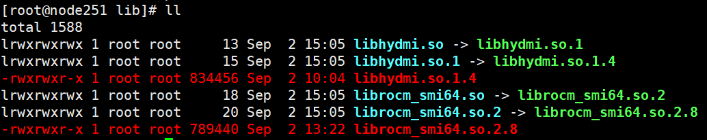

# DCU DCGM

## 组件信息

DCU DCGM 为 DCU 管理提供 Golang 绑定接口，是管理和监控DCU的工具。包括健康状态监控、功率、时钟频率调控，以及资源使用情况统计等。

## 组件使用前置条件
前置条件：DCGM 运行依赖于 DCU 底层动态链接库 `libhydmi.so` 和 `librocm_smi64.so`（MIG 功能还需 `libhydmi_mig.so`），均随 DCU 驱动安装提供，安装方式如下。

#### 安装方式一：
1. 安装 DCU 驱动（上述动态链接库包含在驱动中，默认位于 `/opt/hyhal/lib`）
2. 确认驱动安装完成后，系统可正常加载上述库文件

#### 安装方式二：
适用于已安装 DCU 驱动，但运行环境未自动找到动态库的场景。
1. 确认驱动库目录（通常为 `/opt/hyhal/lib`）下存在 `librocm_smi64.so.2.8`、`libhydmi.so.1.5` 等版本文件；若缺少 `librocm_smi64.so`、`libhydmi.so` 等软链接，可在该目录下创建：
   - `librocm_smi64.so.2` → `librocm_smi64.so.2.8`，`librocm_smi64.so` → `librocm_smi64.so.2`
   - `libhydmi.so.1` → `libhydmi.so.1.5`，`libhydmi.so` → `libhydmi.so.1`
   - （MIG 功能）`libhydmi_mig.so.1` → `libhydmi_mig.so.1.3`，`libhydmi_mig.so` → `libhydmi_mig.so.1`
   
2. 将驱动库目录加入动态库搜索路径：
   ```bash
   export LD_LIBRARY_PATH=$LD_LIBRARY_PATH:/opt/hyhal/lib
   ```

## 使用流程

*目前代码仅在内部gitlab中存放，其他项目调用流程如下：*

1. git clone本项目代码到本地，与调用者项目存放于同级目录中；

2. 调用者项目修改go.mod文件：

```
replace g.sugon.com/das/dcgm-dcu => /your/path/dcgm-dcu
```

3. 在本地项目中执行：

```
go mod tidy
```

4. 在golang文件中import相关依赖包之后使用即可，其中api.go为封装DCGM的API调用，提供与DCGM库交互的各种API接口，处理具体的功能调用。/pkg/samoles下是简单的test：

```go
import (
...
"g.sugon.com/das/dcgm-dcu/pkg/dcgm"
...)


func main(){
...
	dcgm.Init()
    defer dcgm.ShutDown()
...

}
```

